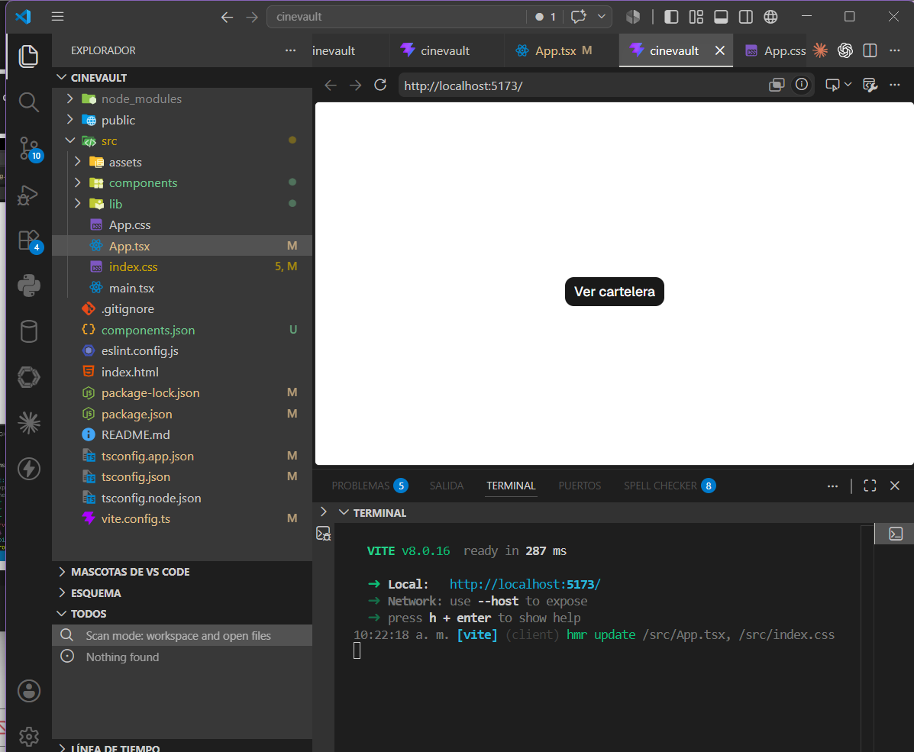
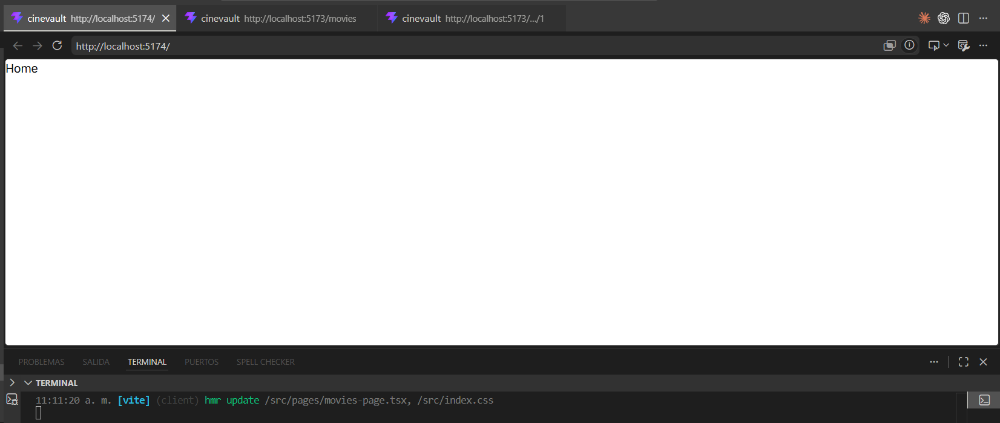
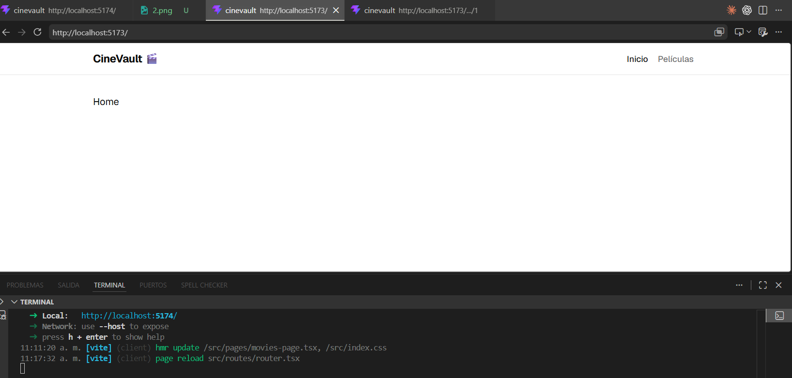
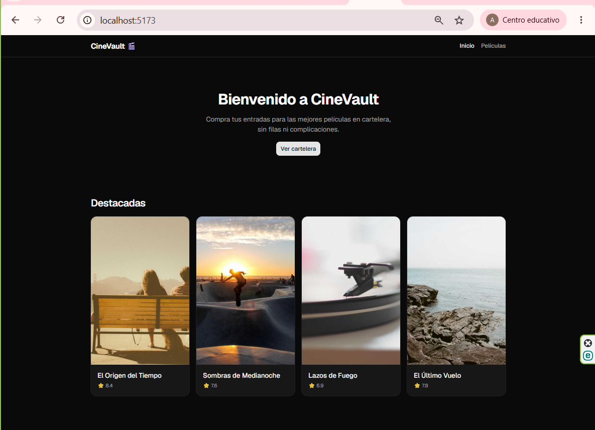

# 🎬 CineVault Frontend

## 👥 Autores
- **Anali Salvador Advincula**
- **Eder Carrasco**

## 📖 Descripción
Aplicación frontend de un e-commerce básico de cine, desarrollada con React + TypeScript + Vite. Permite explorar una cartelera de películas y acceder al detalle de cada una. Pensada como base escalable para un proyecto más grande, sin sobreingeniería.

## 🛠️ Tecnologías
- React 19 (React Compiler)
- TypeScript
- Vite
- Tailwind CSS v4
- shadcn/ui (Radix)
- React Router DOM
- Axios
- TanStack Query
- Node.js v22.20.0

## ⚙️ Instalación y ejecución

1. Clonar el repositorio:
```bash
   git clone https://github.com/anali-salvador/cinevault.git
```
2. Instalar dependencias:
```bash
   npm install
```
3. Correr el servidor de desarrollo:
```bash
   npm run dev
```
4. Abrir en el navegador: `http://localhost:5173`
## 📁 Estructura del proyecto
src/ ├── components/ │ └── ui/ → componentes de shadcn/ui (Button, Card, etc.) ├── data/ │ └── movies.ts → datos mock de películas ├── layouts/ │ └── main-layout.tsx → navbar + footer + <Outlet /> ├── lib/ │ └── utils.ts → utilidades de shadcn (cn helper) ├── pages/ │ ├── home-page.tsx → Hero + grilla de películas destacadas │ ├── movies-page.tsx → cartelera completa │ └── movie-detail-page.tsx → detalle de una película ├── routes/ │ └── router.tsx → definición de las 3 rutas ├── services/ │ └── http-client.ts → instancia de Axios ├── types/ │ └── movie.ts → interface Movie ├── App.tsx ├── index.css └── main.tsx

## 🗺️ Rutas disponibles

| Ruta | Descripción |
|---|---|
| `/` | Home — Hero + películas destacadas |
| `/movies` | Cartelera completa |
| `/movies/:id` | Detalle de una película |

## 🖼️ EVIDENCIAS-Anali Salvador

### 1. Instalación de shadcn/ui


### 2. Rutas configuradas


### 3. Layout funcionando (navegación)


### 4. Homepage con shadcn/ui


## 🖼️ EVIDENCIAS-Ederd Carrasco